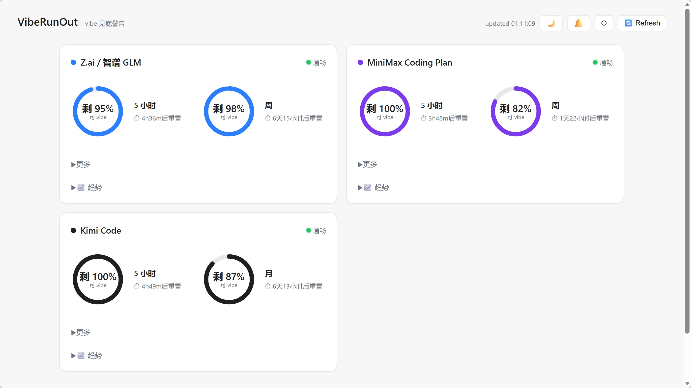

<h1 align="center">🎛️ VibeRunOut</h1>
<p align="center"><em>vibe 见底警告 — 看看你还能 vibe 多久</em></p>

<p align="center">
  <a href="#快速开始">快速开始</a> ·
  <a href="#支持的-provider">支持的 Provider</a> ·
  <a href="#自定义-provider">自定义</a> ·
  <a href="#功能">功能</a> ·
  <a href="#安全">安全</a>
</p>

---

<p align="center">一个纯 Python stdlib 写的本地 dashboard, 统一监控各家 AI Coding Plan (zai / MiniMax / Kimi / 自定义) 的剩余配额。环表示<b>剩余</b>, 用一点少一点, 见底变红。</p>

<p align="center">
  
</p>

<sub>👆 实际运行截图: 圆环倒计时 + 剩余 vibe % + 重置倒计时</sub>

---

## 快速开始

```powershell
# 1. 克隆
git clone https://github.com/zwq871482439/VibeRunOut.git
cd VibeRunOut

# 2. 启动 (零依赖, Python 3.8+ 即可)
python server.py
```

首次启动会自动生成空配置, 然后打开 http://localhost:5000 看到引导卡片。

```powershell
# 3. 点右上角 ⚙ Settings → 启用模板 → 填 key → Save
# 或者直接编辑 config.json
```

`config.json` 长这样（首次启动自动创建）：

```json
{
  "providers": [
    {
      "id": "zai",
      "label": "Z.ai / 智谱 GLM",
      "color": "#2B7FFF",
      "url": "https://api.z.ai/api/monitor/usage/quota/limit",
      "auth": "raw",
      "template": "zai",
      "key": "你的 key",
      "enabled": true
    }
  ]
}
```

## 支持的 Provider

| Provider | 认证 | 显示维度 | Endpoint |
|---|---|---|---|
| **Z.ai / 智谱 GLM** | API Key (raw) | 5 小时 · 周 · 月 | `api.z.ai/api/monitor/usage/quota/limit` |
| **MiniMax Coding Plan** | Bearer (国内) | 5 小时 · 周 | `www.minimaxi.com/v1/token_plan/remains` |
| **Kimi Code** | Bearer | 5 小时 · 月 | `api.kimi.com/coding/v1/usages` |
| **GitHub Copilot** | Bearer (实验) | stub | 个人余额需 org API |

**为什么 Kimi 没有周？** Kimi 的 API 只暴露 5 小时窗口 + 月度总配额, 没有独立的周窗口。官网的"7 天用量"是从月配额折算的, 不重复计算以免误导。

## 自定义 Provider

打开 **⚙ Settings** → **Add custom provider (JSON)**, 粘贴类似下面的配置（`template: "custom"` 走 generic JSONPath 提取器）:

```json
{
  "id": "my-api",
  "label": "My API",
  "color": "#10b981",
  "url": "https://api.example.com/quota",
  "auth": "bearer",
  "key": "sk-xxx",
  "enabled": true,
  "template": "custom",
  "extract": {
    "rings": [
      {
        "title": "5 小时",
        "jsonPath": "$.data.hour5.used",
        "totalJsonPath": "$.data.hour5.limit",
        "resetJsonPath": "$.data.hour5.reset_at",
        "resetUnit": "ms"
      }
    ],
    "extras": [
      { "name": "套餐", "jsonPath": "$.data.tier" }
    ]
  }
}
```

JSONPath 支持 `$.a.b.c` 这种点路径, `resetUnit` 可以是 `ms` / `s` / 不填（自动判断）。

## 功能

- 🎨 **圆环倒计时**: 剩余越多环越满, <20% 见底变红
- 🌙 **暗色主题**: 跟随系统偏好, 顶部 🌙 一键切换
- 📊 **趋势折线图**: 每张卡片底部可折叠 `📈 趋势` (Chart.js), 保留近 7 天
- 🔔 **桌面通知**: 任意窗口剩 <20% 时弹系统通知 (10 分钟冷却)
- 🤚 **拖拽排序**: Settings 里拖动 provider 卡片重排
- 🎛️ **配置面板**: 4 个内置模板 + 自定义 JSON, 调色盘选颜色
- ⚡ **零依赖**: 纯 Python stdlib, 不需要 `pip install`（除了联网拉 Chart.js CDN）
- 🔒 **本地优先**: 只绑 `127.0.0.1`, 密钥不出本机

## 安全

- `config.json` 已加入 `.gitignore`, **永远不会进 git**
- dashboard 只绑 `127.0.0.1`, 局域网其他人访问不到
- 前端 `GET /api/config` 时 key 自动 mask 成 `***xxxx`
- `POST /api/config` 时如果检测到 mask 值, 后端从磁盘回填真 key（避免误覆盖）
- 日志 (`logs/`) 也 gitignore, 不上传 quota 历史

## 项目结构

```
VibeRunOut/
├── server.py              # 单文件, 全部代码 (后端 + 前端 HTML/CSS/JS)
├── config.json            # 你的 key (gitignore, 启动时自动生成)
├── .gitignore             # 保护 config.json + logs/
├── logs/                  # 运行时日志 (gitignore)
│   ├── last_quota.json    # 最近一次 raw response (调试用)
│   └── history.jsonl      # 趋势图数据, 保留 7 天
└── README.md              # 本文件
```

## 已知限制

- **MiniMax 实验性**: 某些账号 endpoint 可能要求 cookie 而非 API key（见 [MiniMax-M2#88](https://github.com/MiniMax-AI/MiniMax-M2/issues/88)），本工具用的是国内版 `minimaxi.com` 的 Subscription Key 路径
- **趋势图需要联网**: Chart.js 走 CDN, 断网时图表区空白但卡片正常
- **桌面通知只在浏览器开着时有效**: 关了标签页就不弹
- **多 provider 并发**: 串行拉取, 3-5 个 provider 无感, 多了可考虑改并发

## 不在范围

- OAuth / Playwright 浏览器登录（Claude Code / Cursor / Codex 那些只能爬）
- 真正的后端定时任务 + Web Push（关了浏览器也弹通知）
- Provider OAuth token 自动续期

## License

MIT — 随便用, 出问题不负责。

---

<p align="center"><sub>built with 🐍 Python stdlib, 💙 & panic about vibe quota</sub></p>
